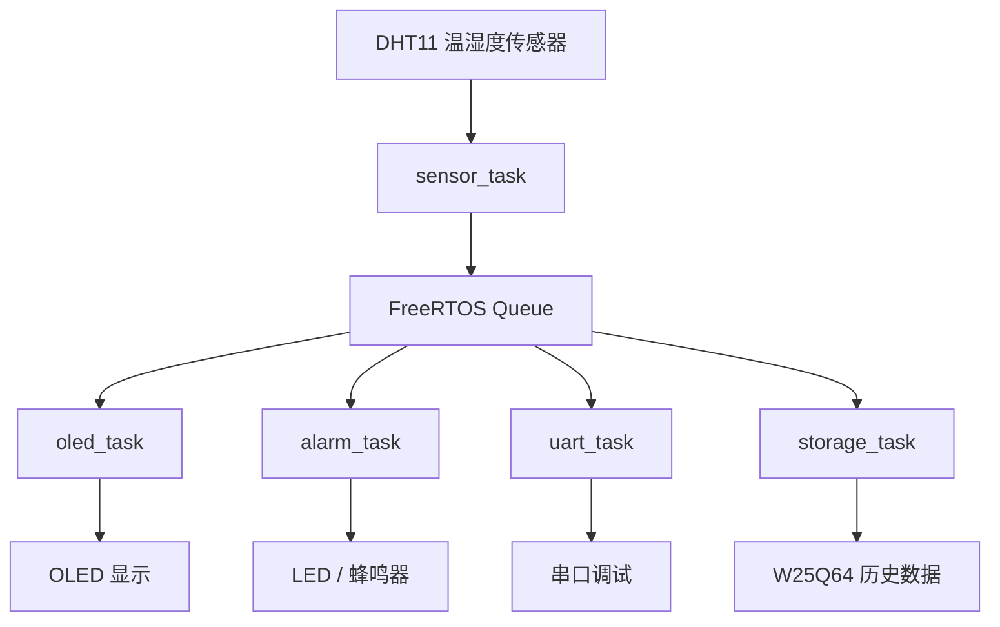

# env-monitor-v2

## 项目简介

本项目是一个基于 STM32 + FreeRTOS 的环境监测系统，主要用于采集温湿度数据，并通过 OLED 屏幕进行实时显示，同时结合 LED、蜂鸣器等外设实现环境状态提示。

项目目标不是简单读取传感器数据，而是通过 FreeRTOS 将传感器采集、数据显示、串口通信、报警提示等功能拆分为多个任务，模拟真实嵌入式项目中的多任务协作方式。

## 硬件组成

- 主控芯片：STM32F103C8T6
- 温湿度传感器：DHT11
- 显示模块：0.96 寸 OLED，I2C 接口
- 存储模块：W25Q64 SPI Flash
- 输入模块：EC11 编码器 / 按键
- 输出模块：LED、蜂鸣器
- 调试接口：DAPLink / ST-Link
- 通信接口：UART 串口

## 项目功能

- DHT11 温湿度采集
- OLED 实时显示温湿度
- EC11 编码器切换显示页面
- LED 显示环境舒适度状态
- 蜂鸣器报警提示
- W25Q64 保存历史数据
- 串口输出调试信息
- FreeRTOS 多任务调度

## 软件架构

项目采用模块化设计，将不同功能拆分到独立驱动文件中，降低模块耦合度，方便后续维护和扩展。

主要模块包括：

- `dht11.c / dht11.h`：温湿度采集
- `oled.c / oled.h`：OLED 底层显示驱动
- `oled_ui.c / oled_ui.h`：OLED 页面显示逻辑
- `ec11.c / ec11.h`：编码器输入处理
- `w25q64.c / w25q64.h`：Flash 存储驱动
- `led_status.c / led_status.h`：环境状态提示
- `usart.c / usart.h`：串口通信
- `main.c`：系统初始化和任务创建

## FreeRTOS 任务划分

| 任务名称 | 功能说明 |
|---|---|
| sensor_task | 周期性读取 DHT11 温湿度数据 |
| oled_task | 刷新 OLED 显示内容 |
| uart_task | 通过串口输出调试信息 |
| alarm_task | 根据温湿度状态控制 LED 和蜂鸣器 |
| storage_task | 将环境数据保存到 W25Q64 Flash |

## 数据流说明

系统运行后，`sensor_task` 负责采集环境数据，并将数据传递给显示任务、报警任务和存储任务。

基本数据流：

```text
DHT11
  ↓
sensor_task
  ↓
温湿度数据结构体
  ↓
oled_task / alarm_task / storage_task / uart_task
## 系统架构

项目整体架构如下：



详细说明见：

- [系统架构说明](docs/architecture.md)
- [FreeRTOS 任务划分说明](docs/freertos_tasks.md)

## FreeRTOS 任务通信机制

本项目使用 `sensor_task` 作为数据源任务，周期性采集 DHT11 温湿度数据，并通过 FreeRTOS 队列将数据发送给 OLED 显示任务、报警任务、串口调试任务和数据存储任务。

使用队列的好处是可以降低任务之间的耦合，避免多个任务直接访问同一份全局变量，同时也便于后续扩展 Linux 网关上传、历史曲线显示等功能。