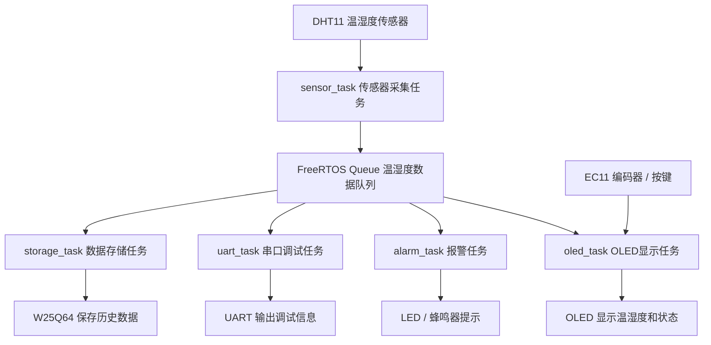
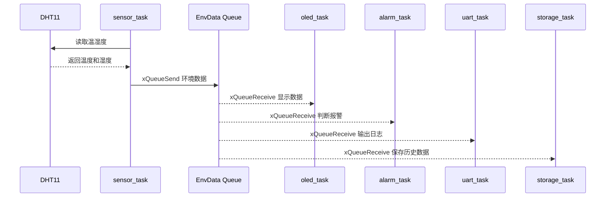

# 系统架构说明

## 一、项目整体架构

本项目是一个基于 STM32 + FreeRTOS 的环境监测系统，主要由传感器采集层、任务调度层、数据显示层、报警提示层、数据存储层和串口调试层组成。

系统通过 DHT11 采集温湿度数据，由 FreeRTOS 中的 sensor_task 周期性读取传感器数据，并通过队列将数据传递给 oled_task、alarm_task、uart_task 和 storage_task。

## 二、系统架构图

## 三、硬件层

| 模块 | 接口 | 作用 |
|---|---|---|
| DHT11 | GPIO 单总线 | 采集温湿度 |
| OLED | I2C | 显示温湿度、状态页面 |
| W25Q64 | SPI | 保存历史环境数据 |
| EC11 | GPIO / EXTI | 页面切换 |
| LED | GPIO | 环境状态提示 |
| 蜂鸣器 | GPIO | 异常报警 |
| UART | USART | 输出调试信息 |

## 四、软件层

软件层采用模块化设计，将外设驱动和业务逻辑分开：

- `dht11.c / dht11.h`：温湿度采集驱动
- `oled.c / oled.h`：OLED 底层驱动
- `oled_ui.c / oled_ui.h`：OLED 页面逻辑
- `ec11.c / ec11.h`：编码器输入处理
- `w25q64.c / w25q64.h`：Flash 存储驱动
- `led_status.c / led_status.h`：环境状态提示
- `main.c`：系统初始化和 FreeRTOS 任务创建

## 五、任务数据流

## 六、设计优势

- 使用 FreeRTOS 拆分任务，避免所有逻辑堆在 while(1)
- 采集、显示、报警、存储和串口输出互相独立
- 使用队列传递数据，降低任务之间的耦合
- 外设驱动模块化，方便后续扩展 Linux 网关或上位机通信
- 项目结构清晰，便于面试讲解和简历展示